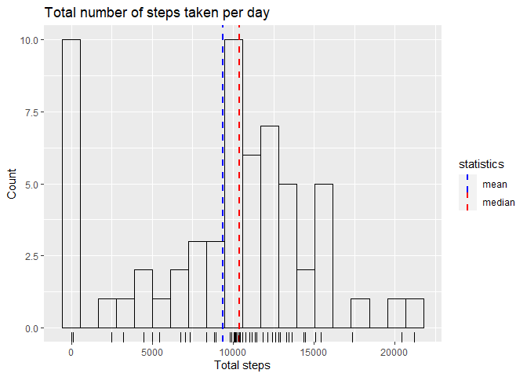
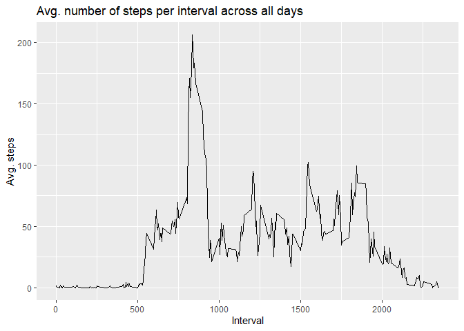
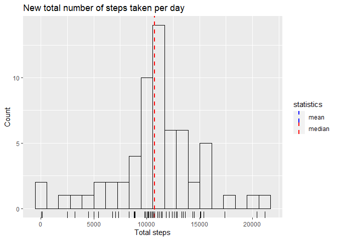

## Introduction

It is now possible to collect a large amount of data about personal movement using activity monitoring devices such as a Fitbit, Nike Fuelband, or Jawbone Up. These type of devices are part of the "quantified self" movement -- a group of enthusiasts who take measurements about themselves regularly to improve their health, to find patterns in their behavior, or because they are tech geeks. But these data remain under-utilized both because the raw data are hard to obtain and there is a lack of statistical methods and software for processing and interpreting the data.

This assignment makes use of data from a personal activity monitoring device. This device collects data at 5 minute intervals through out the day. The data consists of two months of data from an anonymous individual collected during the months of October and November, 2012 and include the number of steps taken in 5 minute intervals each day.

## Data

The data for this assignment can be downloaded from the course web site:

* **Dataset**: [Activity monitoring data](https://d396qusza40orc.cloudfront.net/repdata%2Fdata%2Factivity.zip) [52K]
The variables included in this dataset are:

* **steps**: Number of steps taking in a 5-minute interval (missing values are coded as `NA`)

* **date**: The date on which the measurement was taken in *YYYY-MM-DD* format

* **interval**: Identifier for the 5-minute interval in which measurement was taken

The dataset is stored in a comma-separated-value (CSV) file and there are a total of 17,568 observations in this dataset.


## Loading packages

```r
library(readr)
library(dplyr)
library(ggplot2)
```

## Loading and preprocessing the data


```r
# Make sure that the directory where the data is to be stored exist
if(!file.exists("./data")){dir.create("./data")}
# Unzip file on data folder
unzip(zipfile="activity.zip", exdir="./data")

## Load "activity.csv" in "AMD" variable (Activity Monitoring Device)

# Specify datatype of data columns
cols <- cols(
          steps = col_double(),
          date = col_date(format = "%Y-%m-%d"),
          interval = col_integer()
)

# Read csv file containing the dataset
AMD <- read_csv("data/activity.csv", col_types=cols)

# View the first five rows of dataset
head(AMD)
```

```
## # A tibble: 6 x 3
##   steps date       interval
##   <dbl> <date>        <int>
## 1    NA 2012-10-01        0
## 2    NA 2012-10-01        5
## 3    NA 2012-10-01       10
## 4    NA 2012-10-01       15
## 5    NA 2012-10-01       20
## 6    NA 2012-10-01       25
```


## What is mean total number of steps taken per day?

```r
# Group data by date
steps_per_day <- AMD %>% group_by(date) %>%
                 summarise(total = sum(steps, na.rm=TRUE))

# Get mean and median of steps per day
mean_steps_per_day <- mean(steps_per_day$total)
median_steps_per_day <- median(steps_per_day$total)

# Plot graph
ggplot(steps_per_day, aes(total)) +
  geom_histogram(bins=20, color="black", fill=NA) +
  geom_vline(aes(xintercept=mean_steps_per_day, color="mean"),
            linetype="dashed", size=1) +
  geom_vline(aes(xintercept=median_steps_per_day, color="median"),
            linetype="dashed", size=1) +
  geom_rug() +
  labs(title="Total number of steps taken per day",
       x="Total steps",
       y="Count") +
  scale_color_manual(
        name = "statistics", 
        values = c(mean = "blue", median = "red"))
```

<!-- -->

The *mean* of total steps taken per day is: **9354.2295082**


```r
mean(steps_per_day$total)
```

```
## [1] 9354.23
```

The *median* of total steps taken per day is: **1.0395\times 10^{4}**


```r
median(steps_per_day$total)
```

```
## [1] 10395
```

## What is the average daily activity pattern?


```r
# Group data by interval
steps_per_interval <- AMD %>% group_by(interval) %>%
                      summarise(mean = mean(steps, na.rm=TRUE))

# Get interval with maximum number of steps on average across all the days 
# in the dataset
max_steps <- max(steps_per_interval$mean)
max_steps_interval <- steps_per_interval[steps_per_interval$mean == max_steps, "interval"]$interval

# Plot graph
ggplot(steps_per_interval, aes(x=interval, y=mean)) +
  geom_line() +
  labs(title="Avg. number of steps per interval across all days",
       x="Interval",
       y="Avg. steps")
```

<!-- -->

The *5-minute interval*, on average across all the days in the dataset, that contains the *maximum number of steps* is: interval **835** with **206.1698113** avg. steps.


```r
print(steps_per_interval[steps_per_interval$mean == max_steps, "interval"]$interval)
```

```
## [1] 835
```

```r
print(max(steps_per_interval$mean))
```

```
## [1] 206.1698
```


## Imputing missing values


```r
num_na <- sum(is.na(AMD$steps))
num_na
```

```
## [1] 2304
```

There are **2304 missing values** in the dataset (i.e. the total number of rows with NAs). The presence of missing steps values may introduce bias into some calculations or summaries of the data.

As strategy for filling in all of the missing values in the dataset, I´ll use the **mean of the 5-minute interval** in which the missing value is.


```r
# We find which rows have NAs and match their interval with the interval/row in the table that contains its mean
rows <- match(AMD[is.na(AMD$steps),]$interval, steps_per_interval$interval)

# We create a new dataset that is equal to the original dataset
new_AMD <- AMD

# In the new dataset, replace the Nas with the means
new_AMD[is.na(new_AMD$steps),"steps"] <- steps_per_interval$mean[rows]
```

With the new dataset, I'll make a new histogram of the total number of steps 
taken each day and calculate/report the mean and median total number of steps taken per day. 


```r
# Group data by date
new_steps_per_day <- new_AMD %>% group_by(date) %>%
                     summarise(mean = sum(steps, na.rm=TRUE))

# Get mean and median of total steps per day
new_mean_steps_per_day <- mean(new_steps_per_day$mean)
new_median_steps_per_day <- median(new_steps_per_day$mean)


# Plot graph
ggplot(new_steps_per_day, aes(mean)) +
  geom_histogram(bins=20, color="black", fill=NA) +
  geom_vline(aes(xintercept=new_mean_steps_per_day, color="mean"),
            linetype="dashed", size=1) +
  geom_vline(aes(xintercept=new_median_steps_per_day, color="median"),
            linetype="dashed", size=1) +
  geom_rug() +
  labs(title="New total number of steps taken per day",
       x="Total steps",
       y="Count") +
  scale_color_manual(
        name = "statistics", 
        values = c(mean = "blue", median = "red"))
```

<!-- -->

The *mean* of total steps taken per day is: **1.0766189\times 10^{4}**


```r
mean(new_steps_per_day$mean)
```

```
## [1] 10766.19
```

The *median* of total steps taken per day is: **1.0766189\times 10^{4}**


```r
median(new_steps_per_day$mean)
```

```
## [1] 10766.19
```

These values differ from the estimates from the first part of the assignment. Imputing missing data on the estimates of the total daily number of steps has, as impact, that the mean and median are the same.

## Are there differences in activity patterns between weekdays and weekends?


```r
# Create a new factor variable in the dataset with two levels -- "weekday" and
# "weekend" indicating whether a given date is a weekday or weekend day
new_AMD$day_type <- weekdays(new_AMD$date) %in% c("sábado", "domingo")
new_AMD$day_type <- as.factor(new_AMD$day_type)
levels(new_AMD$day_type) <- c("Weekday", "Weekend")

# Group data by interval and then by day_type
new_steps_per_interval <- new_AMD %>% group_by(interval, day_type) %>%
                          summarise(mean = mean(steps, na.rm=TRUE))

# Plot graph
ggplot(new_steps_per_interval, aes(x=interval, y=mean, color = day_type)) +
  geom_line() +
  facet_grid(day_type~.) +
  labs(title="New Avg. number of steps per interval across all days",
       x="Interval",
       y="Avg. steps") +
  theme(legend.position = "none")
```

<!-- -->

